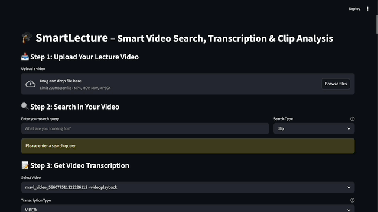

# 🎓 SmartLecture

Smart Video Search, Transcription & Clip Analysis




## Overview

SmartLecture is a powerful tool that helps you analyze and search through lecture videos. It provides features for:
- Video search with keyword and clip-based search
- Automatic transcription generation
- Video clip analysis with timeline visualization
- Smart video playback with precise time control

## Features

- **Smart Video Search**
  - Keyword-based search
  - Clip-based search
  - Timeline visualization
  - Precise video playback control

- **Transcription**
  - Automatic transcription generation
  - Timestamp-based navigation
  - Downloadable transcripts
  - Multiple transcription types (Audio/Video)

- **Video Analysis**
  - Clip merging for related content
  - Visual timeline representation
  - Detailed metadata display
  - Smart playback controls

## Presentation

[View Presentation](https://docs.google.com/presentation/d/1e1Bav260A6MV7p83yX6Ec_Ne0Y2VD6x2/)

## Requirements

- Python 3.8 or higher
- Streamlit
- OpenCV
- Requests
- PyYAML

## Installation

1. Clone the repository:
```bash
git clone [repository-url]
cd [repository-name]
```

2. Create and activate a virtual environment:
```bash
python -m venv .venv
source .venv/bin/activate  # On Windows: .venv\Scripts\activate
```

3. Install dependencies:
```bash
pip install -r requirements.txt
```

## Usage

1. Start the application:
```bash
streamlit run app_search.py
```

2. Upload your lecture video:
   - Supported formats: MP4, MOV, MKV
   - Wait for the video to be processed

3. Use the search features:
   - Enter your search query
   - Choose between keyword or clip search
   - View results with timeline visualization

4. Generate transcriptions:
   - Select the video
   - Choose transcription type
   - Download the generated transcript

## Configuration

The application requires the following API keys:
- MAVI API Key
- GEMINI API Key

Add these to your environment variables or modify the configuration in `app_search.py`.

## License
MIT